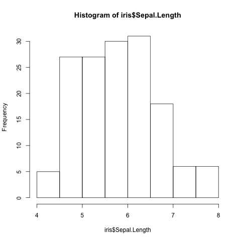
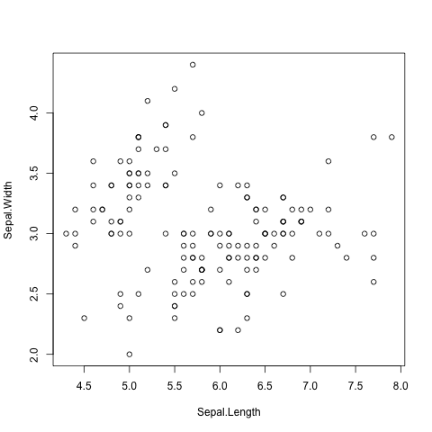
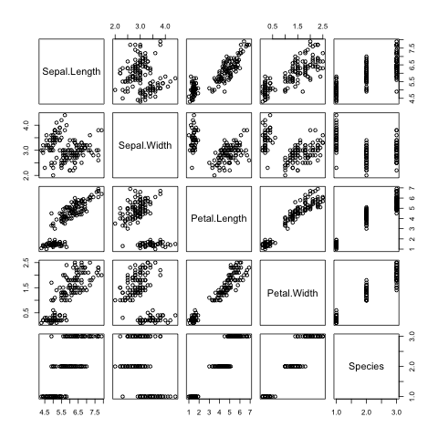
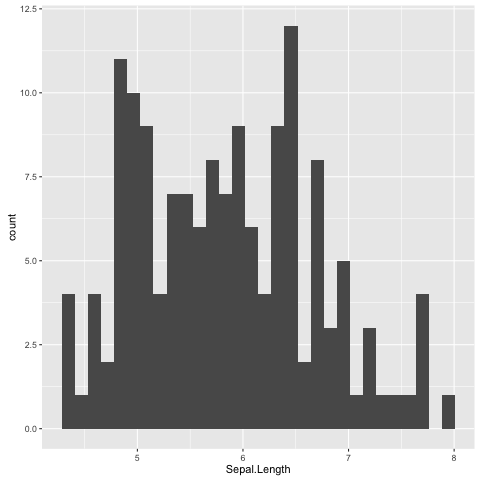
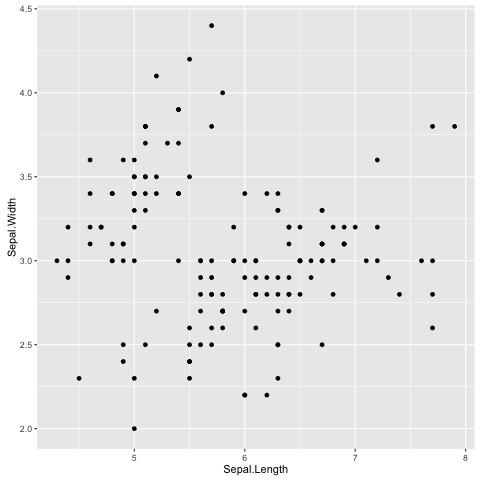
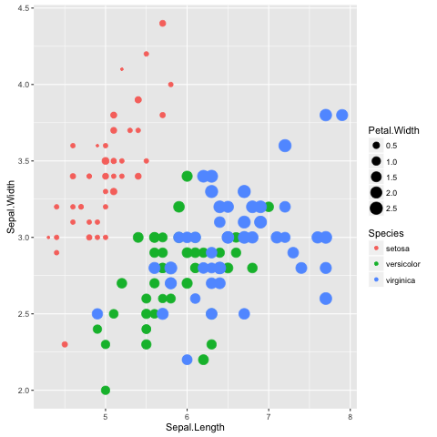
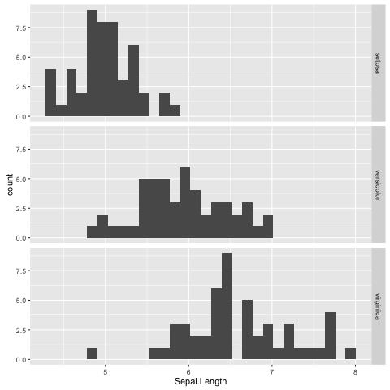
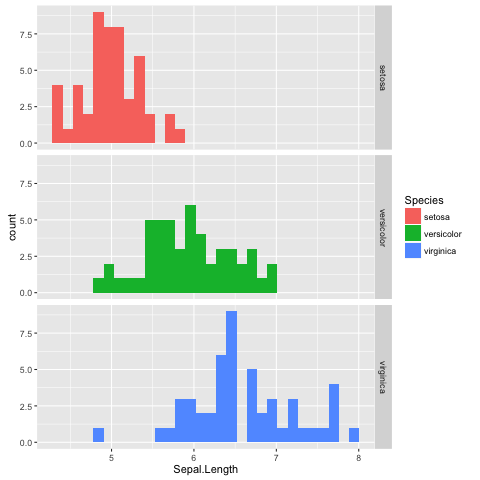

Data visualisation
==================

Introduction
------------

So far we have been learning how to crunch data. Now we will look into
visualising data.

There are many different ways of visualising data and generating figures.  A
broad distinction can be made between *ad-hoc* methods, usually using graphical
user interfaces and button clicking, and methods that can be automated, i.e.
methods that can reproduce the figure without human intervention.

The take home message from this chapter is that you should automate the
generation of your figures. This will save you time when you realize that you
need to alter the style of all the figures when submitting a manuscript for
publication. It also will make your research more reproducible.

There are several tools available for automating the generation of your
figures.  In Python there is the `matplotlib <http://matplotlib.org/>`_
package, which is very powerful and it is a great tool for plotting data
generated from Python scripts.  `Gnuplot <http://www.gnuplot.info/>`_ is a
scripting language designed to plot data and mathematical functions, it is
particularly good at depicting three-dimensional data.  `R
<https://www.r-project.org/>`_ is a statistical scripting language, with
built-in support for data visualisation.  Plotting in R is further enhanced by
the `ggplot2 <http://ggplot2.org/>`_ package which makes it easy to produce
visually pleasing figures. A particularly exiting feature of ggplot2 is that it
simplifies the process visualising data using different types of plots.

In this chapter we will be using R and ggplot2 to visualise and understand
Anderson's
`Iris flower data set <https://en.wikipedia.org/wiki/Iris_flower_data_set>`_.
Finally, we will use R and ggplot2 to create a sliding window plot of the
GC content data from the :doc:`data-analysis` chapter.

Starting R and loading the Iris flower data set
-----------------------------------------------

R like Python can be run in an interactive shell. This is a great way to
get familiar with R. To access R's interactive shell simply type ``R`` into your terminal and press enter.

.. code-block:: none

    $ R

    R version 3.2.2 (2015-08-14) -- "Fire Safety"
    Copyright (C) 2015 The R Foundation for Statistical Computing
    Platform: x86_64-apple-darwin14.5.0 (64-bit)

    R is free software and comes with ABSOLUTELY NO WARRANTY.
    You are welcome to redistribute it under certain conditions.
    Type 'license()' or 'licence()' for distribution details.

      Natural language support but running in an English locale

    R is a collaborative project with many contributors.
    Type 'contributors()' for more information and
    'citation()' on how to cite R or R packages in publications.

    Type 'demo()' for some demos, 'help()' for on-line help, or
    'help.start()' for an HTML browser interface to help.
    Type 'q()' to quit R.

    >

R comes bundled with a number of data sets. To view these you can use the
``data()`` function, which lists all the available data sets.

.. code-block:: R

    > data()
    Data sets in package ‘datasets’:

    AirPassengers           Monthly Airline Passenger Numbers 1949-1960
    BJsales                 Sales Data with Leading Indicator
    BJsales.lead (BJsales)
                            Sales Data with Leading Indicator
    BOD                     Biochemical Oxygen Demand
    CO2                     Carbon Dioxide Uptake in Grass Plants
    ...

We are interested in the Iris flower data set, called ``iris``, let us load
it.

.. code-block:: R

    > data(iris)

This loads the ``iris`` data set into the workspace. You can list the content
of the workspace using the ``ls()`` function.

.. code-block:: R

    > ls()
    [1] "iris"

.. sidebar:: What is a workspace?

    R has the concept of a "workspace". The workspace is the current working
    environment and includes any user defined objects. At the end of a R
    session the user can save the workspace. If saved the workspace will be
    automatically loaded the next time R is started.

Understanding the structure of the ``iris`` data set
----------------------------------------------------

First of all let us find out about the internal structure of the ``iris`` data set using the ``str()`` funciton.

.. code-block:: R

    > str(iris)
    'data.frame':   150 obs. of  5 variables:
     $ Sepal.Length: num  5.1 4.9 4.7 4.6 5 5.4 4.6 5 4.4 4.9 ...
     $ Sepal.Width : num  3.5 3 3.2 3.1 3.6 3.9 3.4 3.4 2.9 3.1 ...
     $ Petal.Length: num  1.4 1.4 1.3 1.5 1.4 1.7 1.4 1.5 1.4 1.5 ...
     $ Petal.Width : num  0.2 0.2 0.2 0.2 0.2 0.4 0.3 0.2 0.2 0.1 ...
     $ Species     : Factor w/ 3 levels "setosa","versicolor",..: 1 1 1 1 1 1 1 1 1 1 ...

This reveals that the ``iris`` data set is a data frame with 150 observations
and five variables. It is also worth noting that ``Species`` is recorded as
a Factor data structure. This means that it has categorical data. In this case
three different species.

In R a data frame is a data structure for storing two-dimensional data, i.e.
like a spreadsheet with rows and columns. In a data frame each column contains
the same type of data and each row has values for each column.

.. sidebar:: What is the difference between vectors, lists and data frames?

    As well as data frames R also has concepts of vectors and lists.
    A vector is a list where each item is of the same type. A list
    is more flexible in that the items can be of different types.
    The data frame is essentially a list of equal length lists.

You can find the names of the columns in a data frame using the ``names()`` function.

.. code-block:: R

    > names(iris)
    [1] "Sepal.Length" "Sepal.Width"  "Petal.Length" "Petal.Width"  "Species"

To find the number of columns and rows one can use the ``ncol()`` and
``nrow()`` functions, respectively.

.. code-block:: R

    > ncol(iris)
    [1] 5
    > nrow(iris)
    [1] 150

To view the first six rows of a data frame one can use the ``head()`` function.

.. code-block:: R

        > head(iris)
      Sepal.Length Sepal.Width Petal.Length Petal.Width Species
    1          5.1         3.5          1.4         0.2  setosa
    2          4.9         3.0          1.4         0.2  setosa
    3          4.7         3.2          1.3         0.2  setosa
    4          4.6         3.1          1.5         0.2  setosa
    5          5.0         3.6          1.4         0.2  setosa
    6          5.4         3.9          1.7         0.4  setosa

To view the last six rows of a data frame one can use the ``tail()`` function.

.. code-block:: R

    > tail(iris)
        Sepal.Length Sepal.Width Petal.Length Petal.Width   Species
    145          6.7         3.3          5.7         2.5 virginica
    146          6.7         3.0          5.2         2.3 virginica
    147          6.3         2.5          5.0         1.9 virginica
    148          6.5         3.0          5.2         2.0 virginica
    149          6.2         3.4          5.4         2.3 virginica
    150          5.9         3.0          5.1         1.8 virginica

A note on statistics in R
-------------------------

Although this book is not about statistics it is worth mentioning that R is a
superb tool for doing statistics. It has many built in functions for statisitcal
computing. For example to calculate the median ``Sepal.Length`` for the ``iris``
data one can use the built in ``median()`` function.

.. code-block:: R

    > median(iris$Sepal.Length)
    [1] 5.8

In the above the ``$`` symbol is used to specify the column of interest in the
data frame.

Another useful tool for getting an overview of a data set is the
``summary()`` function.

.. code-block:: R

    > summary(iris)
      Sepal.Length    Sepal.Width     Petal.Length    Petal.Width
     Min.   :4.300   Min.   :2.000   Min.   :1.000   Min.   :0.100
     1st Qu.:5.100   1st Qu.:2.800   1st Qu.:1.600   1st Qu.:0.300
     Median :5.800   Median :3.000   Median :4.350   Median :1.300
     Mean   :5.843   Mean   :3.057   Mean   :3.758   Mean   :1.199
     3rd Qu.:6.400   3rd Qu.:3.300   3rd Qu.:5.100   3rd Qu.:1.800
     Max.   :7.900   Max.   :4.400   Max.   :6.900   Max.   :2.500
           Species
     setosa    :50
     versicolor:50
     virginica :50

Default plotting in R
---------------------

Before using ggplot2 let us have a look at how to generate default
plots in R.

First of all let us plot a histogram of the ``Sepal.Length``.

.. code-block:: R

    > hist(iris$Sepal.Length)

   Histogram of Iris sepal length data generated using R's built in ``hist()``
   function.

Having to type out the name of the data set every time you want to access
a column from it can get annoying. To overcome this problem R has the
built in function ``attach()``, which can be used to attach objects to R's
search path. This means that the columns in the data frame become available
via their names.

.. code-block:: R

    > attach(iris)

We can now produce the same histogram using the command below.

.. code-block:: R

    > hist(Sepal.Length)

Scatter plots can be produced using the ``plot()`` function.
The command below produces a scatter plot of ``Sepal.Length``
versus ``Sepal.Width``.

.. code-block:: R

    > plot(Sepal.Length, Sepal.Width)

   Scatter plot of Iris sepal length vs width generated using R's built in ``plot()``
   function.

Finally, a decent overview of the all data can be obtained by passing the
entire data frame to the ``plot()`` function.

.. code-block:: R

    > plot(iris)

   Overview plot of Iris data using R's built in ``plot()`` function.

R's built in plotting functions are useful for getting quick exploratory
views of the data. However, they are a bit dull. In the next section we will
make use of the ggplot2 package to make more visually pleasing and informative
figures.

Loading the ggplot2 package
---------------------------

In order to make use of the ggplot2 package we need to load it. This is achieved
using the ``library()`` function.

.. sidebar:: Why do I load a package using a function called library?

    There are many aspects of R, which can be confusing. A common confusion
    stems around the usage of the words library and package.

    In R the term "package" refers to a structured collection of functions,
    data and compiled code, whereas the term "library" refers to the location
    where packages are stored.

    However, because of the naming of the ``library()`` function many people
    think it is used to load libraries. However it does not, it loads packages.
    This has resulted in the terms library and package being used
    interchangeably. 

    This may all sound a bit esoteric, but it does illustrate why you should take
    care when naming your variables, functions and scripts. If you name them
    inappropriately they will cause confusion.

.. code-block:: R

    > library("ggplot2")

Plotting using ggplot2
----------------------

To get an idea of what it feels like to work with ggplot2 let us re-create the
previous histogram and scatter plot with it.

Let us start with the histogram.

.. code-block:: R

    > ggplot(data=iris, mapping=aes(Sepal.Length)) + geom_histogram()

   Histogram of Iris sepal length data generated using R's ggplot2 package.
   The bin width used is different from the one used by R's built in ``hist()``
   function, hence the difference in the appearance of the distribution.

The syntax used may look a little bit strange at first. However, before going
into more details about what it all means let's create the scatter plot to
get a better feeling of how to work with ggplot2.

.. code-block:: R

    > ggplot(data=iris, mapping=aes(x=Sepal.Length, y=Sepal.Width)) + geom_point()

   Scatter plot of Iris sepal length vs width generated using R's ggplot2
   package.

In the examples above we provide the ``ggplot()`` function with two
arguments ``data`` and ``mapping``. The former contains the data frame
of interest and the latter specifies the columns(s) to be plotted.

The ``ggplot`` function returns a ggplot object that can be plotted.  However,
in order to view an actual plot one needs to add a layer to the ggplot object
defining how the data should be presented.  In the examples above this is
achieved using the ``+ geom_histogram()`` and ``+ geom_point()`` syntax.

A ggplot object consists of separate layers. The reason for separating out the
generation of a figure into separate layers is to allow the user to better be
able to reason about the best way to represent the data.

The three layers that we have come across so far are:

- Data: the data to be plotted
- Aesthetic: how the data should be mapped to the aesthetics of the plot
- Geom: what type of plot should be used

Of the above the "aestheitc" layer is the trickest to get ones head around.
However, take for example the scatter plot, one aesthetic choice that we have
made for that plot is that the ``Sepal.Length`` should be on the x-axis and
the ``Sepal.Width`` should be on the y-axis.

To reinforce this let us augment the scatter plot by sizing the points in the
scatter plot by the ``Petal.Width`` and coloring them by the ``Species``, all
of which could be considered to be aesthetic aspects of how to plot the data.

.. code-block:: R

    > ggplot(iris, aes(x=Sepal.Length, y=Sepal.Width, size=Petal.Width, color=Species)) + geom_point()

   Scatter plot of Iris sepal length vs width, where the size of each point represents
   the petal width and the colour is used to indicate the species.

By adding these additional aesthetic attributes to the figure we can start to
discern some structure that was previously hidden.

Scripting data visualisation
----------------------------

Now that we have got a basic understanding of how to interact with R and the functionality
in the ggplot library let's take a step towards automating the figure generation by
recording the steps required to plot the data in a script.

Let us work on the histogram example. In the code below we store the ggplot
object in the variable ``g`` and make use of ``ggsave()`` to write the plot to
a file named ``histogram.png``. Save the code below to a file named
``iris_sepal_length_histogram.R``

.. code-block:: R

    
    library("ggplot2")
    data(iris)

    g <- ggplot(data=iris, aes(Sepal.Length)) +
         geom_histogram()

    ggsave('iris_sepal_length_histogram.png')

To run this code we make use of the program ``Rscript``, which comes bundled with your
R installation.

.. code-block:: none

    $ Rscript iris_sepal_length_histogram.R

This will write the file ``iris_sepal_length_histogram.png`` to your current working
directory.

Faceting
--------

In the extended scatterplot example we found that it was useful to be able to
visualise which data points belonged to which species. Maybe it would be useful
to do something similar with the data in our histogram.

In order to be able to achieve this ggplot2 provides the concept of faceting,
the ability to split your data by one or more variables. Let us split the
data by ``Species`` using the ``facet_grid()`` function.

.. code-block:: R

    library("ggplot2")
    data(iris)

    g <- ggplot(data=iris, aes(Sepal.Length)) +
         geom_histogram() +
         facet_grid(Species ~ .)

    ggsave('histogram.png')

In the above the ``facet_grid(Species ~ .)`` states that we want one
``Species`` per row, as opposed to one species per column
(``facet_grid(. ~ Species)``). Replacing the dot (``.``) with another
variable would result in a faceting the data into a two dimensional grid.

   Histogram of Iris sepal length data faceted by species.

Adding more colour
------------------

The faceted histogram plot clearly illustrates that there are differences
in the distributions of the sepal length between the different Iris species.

However, suppose that the faceted histogram figure was meant to be displayed
next to the extended scatter plot produced above. To make it easier to make
the mental connection between the two data representations it may be useful
to colour the histograms by species as well.

The colour of a histogram is an aesthetic characteristic. Let us add the
fill colour as an aesthetic to the histogram geometric object.

.. code-block:: R

    library("ggplot2")
    data(iris)

    g <- ggplot(data=iris, aes(Sepal.Length)) +
         geom_histogram(aes(fill=Species)) +
         facet_grid(Species ~ .)

    ggsave('histogram.png')

   Histogram of Iris sepal length data faceted and coloured by species.

Background
----------

- Purpose of data visualisation
- History of data visualisation

How to create informative figures
---------------------------------

- Audience
- Message
- Medium

Scripting the generation of your plot
-------------------------------------

- Matplotlib
- Gnuplot
- R

Writing a caption
-----------------

Other useful tools for scripting the generation of figures
----------------------------------------------------------

- Graphviz
- ImageMagick
- D3js

Key concepts
------------
