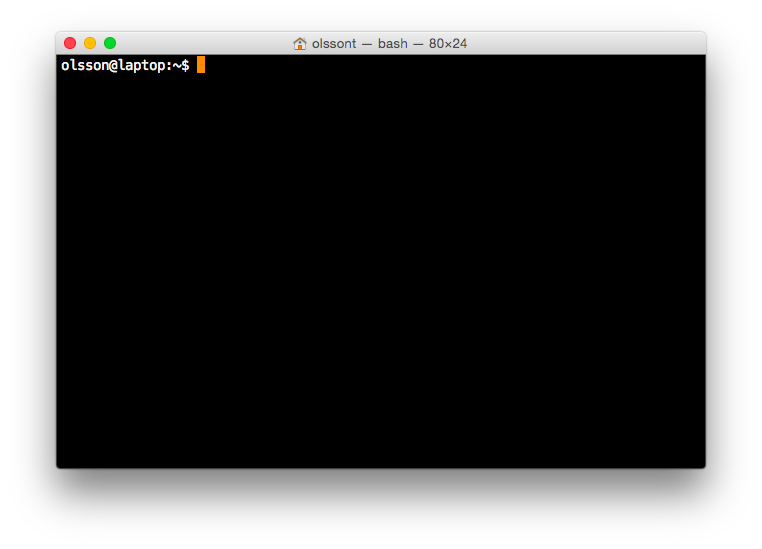

First steps towards automation
==============================

One of the first steps towards automating repetitive tasks is to become
familiar with the command line. In this chapter we will accomplish this by
using the command line to extract UniProt identifiers for all human proteins in
Swiss-Prot.

You will get the most benefit from this chapter if you work through the example
as you go along. You are therefore encouraged to open up a terminal now
(:numref:`terminal`)!

.. _terminal:

   Bash shell running in a Terminal application. The prompt displays the the
   name of the user (olsson), the name of the machine (laptop) and the current
   working directory (~). Note that the dollar symbol (``$``) is an indication
   that input is expected, i.e. the shell expects commands to be entered after
   it. The prompt displayed in the Bash shell can be customised. As such the
   prompt on your system may look different.

On Macs the command line is available through the Terminal application. There
are a number of terminal emulators available for Linux. If you are using the
Gnome-based desktop the default is likely to be the Gnome Terminal.

On Windows things are a little bit more complicated. Windows does not come
bundled with Bash by default. I would recommend installing
`VirtualBox <https://www.virtualbox.org/>`_ and running a Linux distribution
such as `BioLinux <http://environmentalomics.org/bio-linux-download/>`_ in
it. VirtualBox is a so called :term:`hypervisor` that lets you run a :term:`virtual
machine`. In this scenario you would run BioLinux as a virtual machine.
For more information on how to run BioLinux as a virtual machine see the
`BioLinux installation notes <http://environmentalomics.org/bio-linux-installation/>`_.

A terminal emulator is an application that gives you access to another program
known as the shell. The shell allows you to interact with the operating system's
services and programs. Just like there is a diversity of terminal emulators
there are also a number of different shells. The most widely used shell and the
default on Mac and most Linux based distributions is ``bash``.

First things first, how to find help
------------------------------------

Most of the commands on the command line have built in help that can be accessed by
providing either the argument ``-h`` or ``--help``. For example to access help for
the ``gunzip`` command, which we will use later, enter the command below into the shell
and press enter:

.. code-block:: none

    $ gunzip --help

More descriptive documentation can usually be found using the ``man`` (manual)
command. For example to view the manual page of the ``ls`` command you can run
the command below.

.. code-block:: none

    $ man ls

To get out of the "man-page" press the "q" key. Just like I encourage you to try
out the examples outlined in this chapter, I also encourage you to examine the
help and man-page documentation for the commands that we use to get a better
understanding of what the commands do.

Creating a new directory for our project
----------------------------------------

First of all let us make sure that we are working in our home directory.

.. code-block:: none

    $ cd

The ``cd`` command, short for *change directory*, is used to move between
directories. If called without a path to a directory it will move you into your
home directory.

We can *print* out the name of the current *working directory* using the ``pwd``
command. Furthermore we can *list* the contents of a directory using the ``ls``
command.

.. code-block:: none

    $ pwd
    /home/olsson
    $ ls

Now that we know where we are and what files and directories are present let us
create a new directory for our project. This is achieved using the ``mkdir``
command, short for *make directory*. After having created the directory move
into it using the ``cd`` command.

.. code-block:: none

    $ mkdir first_step_towards_automation
    $ cd first_step_towards_automation

.. note:: When using the command line one learns to avoid using white spaces in
          file and directory names. This is because white spaces are used to separate
          arguments. In the example above we used underscores instead of white spaces.
          However, one could just as well have used hyphens. This comes down to personal
          preference. It is possible to represent file names with spaces in them on the
          command line by using the backlash character (``\``) to "escape" the
          whitespace, for example ``first\ steps\ towards\ automation`` or by surrounding
          the text in quotes ``"first steps towards automation"``.

Downloading the Swiss-Prot knowledge base
-----------------------------------------

UniProt (Universal Protein Resource) is a comprehensive resource of protein
sequences and annotations. The UniProt Knowledgebase (UniProtKB) consists of 
Swiss-Prot and TrEMBLE. Both are annotated. However, the procedure in which
they are annotated differ. TrEMBLE uses an automatic annotation system, whereas
the annotation in SwissProt is manual and includes a review process.

It is time to download the Swiss-Prot knowledge base from UniProt. We will
use the ``curl`` program to do this.  The ``curl`` command is a C program that
allows us to stream data from URLs and FTP sites.  By default the ``curl``
program writes the content of the URL to the :term:`standard output stream`.
To see this in action try running the command:

.. code-block:: none

    $ curl www.bbc.com

You should see a whole lot of HTML text appearing in your terminal window.

However, because we are going to download a large file we would like to
write it to disk for future use. Many command line programs allow the user to
specify additional options. In this particular case we can use the
``--output`` option to specify a file name that the output should be
written to. To exemplify this let us download the BBC home page to a file named
``bbc.html``.

.. code-block:: none

    $ curl --output bbc.html  www.bbc.com

Here we will use a URL shortened using `bitly <https://bitly.com/>`_ to save on
typing. The shortened URL contains a redirect to the relevant Swiss-Prot FASTA
file hosted on the UniProt FTP site. To find out where the shortned URL redirects
to run the command:

.. code-block:: none

    $ curl http://bit.ly/1l6SAKb

.. sidebar:: What is URL shortening?

    URL shortening is a means to make URLs shorter whilst still directing the
    client to the desired page. It is achieved by using a redirect from a domain
    that is short, to the page with the longer URL. To view the HTTP redirect
    code, ``301 Moved Permenantly``, you can use ``curl``'s verbose option.

    .. code-block:: none

        $ curl --verbose http://bit.ly/1l6SAKb

To allow the redirection to occur we need to use the ``--location`` option,
which will redirect the request to the new location.
Let us download the gzipped FASTA file from the UniProt FTP site:

.. code-block:: none

    $ curl --location --output uniprot_sprot.fasta.gz http://bit.ly/1l6SAKb

The downloaded file ``uniprot_sprot.fasta.gz`` has been compressed using the
``gzip`` protocol.  We can extract it using the ``gunzip`` command.  However,
when extracted it more than doubles in size. So we will use the ``--to-stdout``
option to extract the content to the standard output stream whilst leaving the
original file compressed.

Try running the command:

.. code-block:: none

    $ gunzip --to-stdout uniprot_sprot.fasta.gz

You should see a lot of FASTA lines printed to your terminal, or more formally
the standard output stream.

.. sidebar:: What is a FASTA file?

    FASTA is a simple file format for storing nucleotide or peptide sequences.
    It consists of a single-line description, starting with the greater than
    symbol (``>``), and a sequence which can be spread over several lines.

    .. code-block:: none

        >TATA box
        TATAAA
        >Pribnow box
        TATAAT

Options starting with two dashes, ``--``, are known as long options. Many of
these long options also have abbreviated "short" options. For example, the
``-c`` option of ``gunzip`` is equivalent to the  ``--to-stdout`` option. Try
running the command:

.. code-block:: none

    $ gunzip -c uniprot_sprot.fasta.gz

From now on the text will use the short ``-c`` option rather than the long
``--to-stdout`` option to save on typing.

.. note:: Remember that you can use the ``--help`` or ``-h`` option to get
          information on the meanings of the various options available to you.

.. sidebar:: Tab completion

    Another way to save on typing in the terminal is to use tab completion.
    Start typing the command that you want to use and hit the tab key. For
    example, type in ``gu`` and then press the tab key. This will complete
    the command to ``gunzip`` without you having to do any more typing.
    If the letters typed into the terminal are not sufficient to specify
    a unique command it will list all of the possible options.

    You can also use tab completion to fill in the names of existing files and
    directories.

.. _creating_workflows_using_pipes:

Creating a work flow using pipes
--------------------------------

Now it is time to introduce one of the greatest features of the command line: pipes!
Pipes are a means to redirect the output from one command into another. The character
used to represent a pipe is the vertical bar: ``|``.

To illustrate the use of pipes we will redirect the output of the previous
``gunzip`` command to the word count program ``wc``. Try running the command
below:

.. code-block:: none

    $ gunzip -c uniprot_sprot.fasta.gz | wc

.. sidebar:: Re-using previous command

    Rather than having to retype commands try using the "Up" and "Down" arrows
    to get access to previous commands.

It should give you three numbers, these are the line, word and character counts. To
only see the line count one could use the ``-l`` option:

.. code-block:: none

    $ gunzip -c uniprot_sprot.fasta.gz | wc -l

Pipes are powerful because they allow a set of simple commands to be combined
to perform tasks that are beyond the scope of any of the individual commands.
This has led to a central Unix philosophy of having simple programs that do one
task well and a rich ecosystem of such programs. The user is then free to
combine these programs to create personalised tools to automate repetitive
processing tasks.

Another powerful feature of pipes is that the program being piped to gets
access to the output stream of data from the program piping data into the pipe
as soon as it is available. This means that the processing of data can happen
in parallel.

Examining files, without modifying them
---------------------------------------

Unix-based systems make a distinction between programs that are used for
examining files, known as pagers, and programs that are used for editing files,
known as text editors. The reason for making this distinction is to help prevent
accidental changes to files when reading them.

To view the beginning of a file one can use the ``head`` command. Let us examine
the first lines of the ``uniprot_sprot.fasta.gz`` file by pipeing the output of the
``gunzip`` command into ``head``:

.. code-block:: none

    $ gunzip -c uniprot_sprot.fasta.gz | head

You should see something like the output below being written to the terminal
window.

.. code-block:: none
   :caption: First ten lines of the ``uniprot_sprot.fasta.gz`` file. Note that
             the identifier lines have been truncated to only display the first
             65 characters.

    >sp|Q6GZX4|001R_FRG3G Putative transcription factor 001R OS=Frog ...
    MAFSAEDVLKEYDRRRRMEALLLSLYYPNDRKLLDYKEWSPPRVQVECPKAPVEWNNPPS
    EKGLIVGHFSGIKYKGEKAQASEVDVNKMCCWVSKFKDAMRRYQGIQTCKIPGKVLSDLD
    AKIKAYNLTVEGVEGFVRYSRVTKQHVAAFLKELRHSKQYENVNLIHYILTDKRVDIQHL
    EKDLVKDFKALVESAHRMRQGHMINVKYILYQLLKKHGHGPDGPDILTVKTGSKGVLYDD
    SFRKIYTDLGWKFTPL
    >sp|Q6GZX3|002L_FRG3G Uncharacterized protein 002L OS=Frog virus ...
    MSIIGATRLQNDKSDTYSAGPCYAGGCSAFTPRGTCGKDWDLGEQTCASGFCTSQPLCAR
    IKKTQVCGLRYSSKGKDPLVSAEWDSRGAPYVRCTYDADLIDTQAQVDQFVSMFGESPSL
    AERYCMRGVKNTAGELVSRVSSDADPAGGWCRKWYSAHRGPDQDAALGSFCIKNPGAADC

The beauty of the ``head`` command is that it allows you to quickly view the
beginning of a file without having to read in the content of the entire file.
The latter can present a real problem if working on "big data" files. In fact,
this is also the beauty of pipes, which allows downstream programs to work on
the stream of data without having to wait for it to be written to or read from
disk.

By default the ``head`` command writes out the first ten lines. However, this
can be modified using the ``-n`` option, for example to write out the first 20
lines:

.. code-block:: none

    $ gunzip -c uniprot_sprot.fasta.gz | head -n 20

Similarly, there is a ``tail`` command for displaying the tail end of a file,
again ten lines by default.

.. code-block:: none

    $ gunzip -c uniprot_sprot.fasta.gz | tail

You may have noticed that the workflow above, to view the last ten lines, took
a little longer to complete.  That is because we needed to decompress the whole
file before we could access the last ten lines of it.

To page through an entire file one can use the ``less`` command.

.. code-block:: none

    $ gunzip -c uniprot_sprot.fasta.gz | less

One can use the "Up" and "Down" arrows to navigate through the file using
``less``.  One can also use the "Space" key to move forward by an entire page,
hence the term pager. To page back one page press the "b" key. When you are
finished examining the file press "q" to quit ``less``.

.. sidebar:: How am I supposed to be able to remember that ``less`` is a pager?

    As you may have noticed, if one does not use a pager, the standard output
    is simply written to the terminal. This can be frustrating if the file is
    large and one wants to start reading at the top of the file and then page
    through it as one reads along. This is what pagers are for, moving
    through files one page at a time.  One of the original pager programs was
    called ``more``.  It simply displayed one page of output at a time and when
    one wanted "more" output one simply pressed the space key. A usability
    issue with the ``more`` program was that it did not allow users to go back
    up a page. The ``less`` pager was therefore developed to work around this
    issue. It implemented reverse scrolling and a number of other additional
    features not present in ``more``. However, ``less`` also implemented all
    the original features of the ``more`` program, resulting in the mnemonic
    "less is more".

Finding FASTA identifier lines corresponding to human proteins
--------------------------------------------------------------

Now that we have an idea of what the file looks like it is time to extract the
FASTA identifiers that correspond to human proteins.

A powerful command for finding lines of interest in text is the ``grep``
program, which can be used to search for strings and patterns. Let us use it to
search for the string "Homo":

.. code-block:: none

    $ gunzip -c uniprot_sprot.fasta.gz | grep Homo | less

To make the match more visible we can add the ``--color=always`` option, which
will highlight the matched string as red.

.. code-block:: none

    $ gunzip -c uniprot_sprot.fasta.gz | grep --color=always Homo | less

If you scroll through the matches you will notice that we have some false
positives. We can highlight these by performing another ``grep`` command that
finds lines that do not contain the string "sapiens", using the
``--invert-match`` option or the equivalent ``-v`` short option.

.. code-block:: none

    $ gunzip -c uniprot_sprot.fasta.gz | grep Homo | grep -v sapiens

To make the search more specific we can search for the string "OS=Homo sapiens".
To do this we need to surround the search pattern by quotes, which tells the shell that
the two parts separated by a white space should be treated as one argument.

.. code-block:: none

    $ gunzip -c uniprot_sprot.fasta.gz | grep "OS=Homo sapiens"

To work out how many lines were matched we can pipe the output of ``grep`` to
the ``wc`` command.

.. code-block:: none

    $ gunzip -c uniprot_sprot.fasta.gz | grep "OS=Homo sapiens" | wc -l

Extracting the UniProt identifiers
----------------------------------

Below are the first three lines identified using the ``grep`` command.

.. code-block:: none
   :caption: First three lines of the ``uniprot_sprot.fasta.gz`` file
             identified using the ``grep`` command. Note that the lines have
             been truncated to only display the first 65 characters.

    >sp|P31946|1433B_HUMAN 14-3-3 protein beta/alpha OS=Homo sapiens ...
    >sp|P62258|1433E_HUMAN 14-3-3 protein epsilon OS=Homo sapiens GN=...
    >sp|Q04917|1433F_HUMAN 14-3-3 protein eta OS=Homo sapiens GN=YWHA...

Now that we can identify description lines corresponding to human proteins we
want to extract the UniProt identifiers from them. In this instance we will use
the command ``cut`` to chop the line into smaller fragments, based on a
delimiter character, and print out the relevant fragment.  The delimiter we are
going to use is the vertical bar ("|"). This has got nothing to do with
pipeing, it is simply the character surrounding the UniProt identifier. By
splitting the line by "|" the UniProt id will be available in the second
fragment.

The command below makes use of the backslash character (``\``) at the end of
the first line.  This tells bash that the command continues on the next line.
You can use this syntax in your scripts and in the terminal. Alternatively, you
can simply include the content from both lines below in a single line, omitting
the ``\``.

.. code-block:: none

    $ gunzip -c uniprot_sprot.fasta.gz | grep "OS=Homo sapiens" \
    | cut -d '|' -f 2

In the above the ``-d`` option specifies the delimiter to use to split split
the line, in this instance the pipe symbol (``|``). The ``-f 2`` option
specifies that we want to extract the second field.

.. note:: Remember to try out these commands on your computer to see the
          actual output of the commands.

Using redirection to create an output file
------------------------------------------

By default the output from commands are written to the standard output stream.
Earlier we saw that we could use the pipes to redirect the output to another
command. However, it is also possible to redirect the output to a file, i.e.
save the output to a file.  This is achieved using the greater than symbol
(``>``). You can use the idea of an arrow as a mnemonic, the output is going
from the command into the file as indicated by the arrow.

.. code-block:: none

    $ gunzip -c uniprot_sprot.fasta.gz | grep "OS=Homo sapiens" \
    | cut -d '|' -f 2 > human_uniprot_ids.txt

Now if you run the ``ls`` command you will see the file
``human_uniprot_ids.txt`` in the directory and you can view its contents using
``less``:

.. code-block:: none

    $ less human_uniprot_ids.txt

.. sidebar:: The ``<`` redirection command

             There is a third type of redirection ``<``. This type of redirection
             is so common that it is often made implicit. The two commands below, for
             example, are equivalent.
            
             .. code-block:: none

                $ wc -l < human_uniprot_ids.txt
                   20197
                $ wc -l human_uniprot_ids.txt
                   20197 human_uniprot_ids.txt

Well done! You have just extracted the UniProt identifiers for all human
proteins in Swiss-Prot. Have a cup of tea and a biscuit.

The remainder of this chapter will go over some more useful commands for
working on the command line and reiterate some of the key take home messages.

Viewing the command history
---------------------------

Okay, so you have had a relaxing cup of tea and your head is no longer buzzing
from information overload. However, you have also forgotten how you managed to
extract those UniProt identifiers.

Not to worry. You can view the history of your previous commands using ``history``:

.. code-block:: none

    $ history

Note that each command has a history number associated with it.  You can use
the number in the history to rerun a previous command without having to
retype it. For example to rerun command number 597 you would type in:

.. code-block:: none

    $ !597

Note that the exclamation mark (``!``) in the above is required.

Clearing the terminal window
----------------------------

After having run the ``history`` command the terminal window is full of information.
However, you find it distracting to have all those commands staring at you whilst
you are trying to think.

To clear the screen of output one can use the ``clear`` command:

.. code-block:: none

    $ clear

Sometimes, for example if you try to view a binary file using a pager, your
shell can start displaying garbage. In these cases it may help to run the
``reset`` command.

.. code-block:: none

    $ reset

In general it is advisable to use ``clear`` as it only clears the terminal screen
whereas ``reset`` reinitialises the terminal.

Copying and renaming files
--------------------------

You want to store a copy of your ``human_uniprot_id.txt`` file in a backup
directory.

For this exercise let us start by creating a backup directory.

.. code-block:: none

    $ mkdir backup

Now we can copy the file into the backup directory using the ``cp`` command.

.. code-block:: none
    
    $ cp human_uniprot_id.txt backup/

The command above uses the original name of the file. However, we could have
given it a different name, for example including the date.

.. code-block:: none
    
    $ cp human_uniprot_id.txt backup/human_uniprot_id_2015-11-10.txt

Finally, suppose that one wanted to rename the original file to use hyphens
rather than under scores. To to this one would use the ``mv`` command, mnemonic
*move*. 

.. code-block:: none
    
    $ mv human_uniprot_id.txt human-uniprot-id.txt

Removing files and directories
------------------------------

Having experimented with the command line we want to clean up by removing
unwanted files and directories. 

One can remove files using the ``rm`` command:

.. code-block:: none

    $ rm backup/human_uniprot_id.txt

Empty directories can be removed using the ``rmdir`` command:
    
.. code-block:: none

    $ mkdir empty
    $ rmdir empty

To remove directories with files in them one can use the ``rm`` command with
the recursive option:

.. code-block:: none

    $ rm -r backup

.. warning:: Think twice before deleting files, they will be deleted permanently.
             When using ``rm`` there is no such thing as recycle bin from which
             the files can be recovered.

Key concepts
------------

- The command line is an excellent tool for automating repetitive tasks
- A terminal application provides access to a shell
- A shell allows you to interact with the operating system's services and programs
- The most commonly used shell is Bash
- Pipes can be used to combine different programs into more complicated work flows
- In general it is better to create small tools that do one thing well
- Think twice before deleting files
- Use the ``-help`` option  to understand a command and its options
