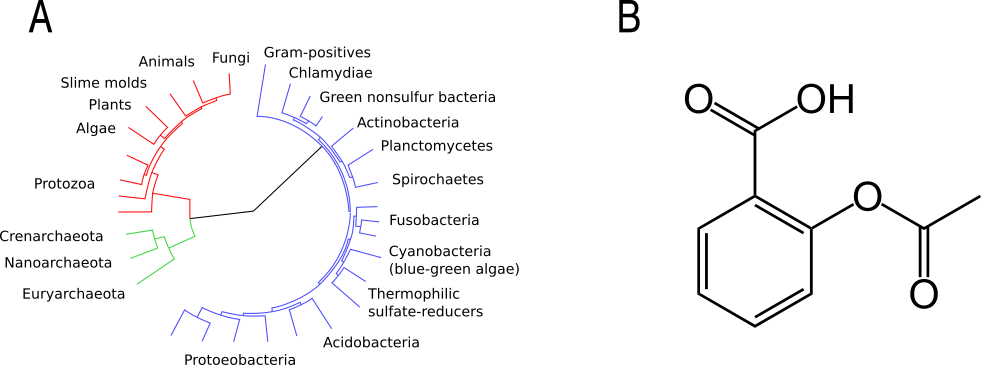

Structuring and storing data
============================

The biological sciences are becoming more and more data driven.
However, dealing with large volumes of data can feel overwhelming.
One way to regain some control is to ensure that there is some structure to
the data. This chapter introduces important data structures and file formats
for representing them.

Data structures
---------------

In :doc:`how-to-think-like-a-computer` we introduced some basic data types,
including integers, floating point numbers, characters and strings. However,
most of the time we are not interested in individual instances of integers or
floating point values, we want to analyse lots of data points, often of a
heterogeneous nature.

We need some way of structuring our data. In computing there are several well
defined data structures for accomplishing this. Three data structures of particular
interest are lists, dictionaries and graphs. Lists and dictionaries are generally
useful and graphs are of particular interest in biology and chemistry.

A list, also known as an array, is basically a collection of elements in a
specific order. The most common use case is to simply go through all the
elements in a list and do something with them. For example if you had a stack
of Petri dishes you might go through them, one-by-one, and only keep the ones
that had single colonies suitable for picking.  This is similar to what we did
with the FASTA file in :doc:`first-steps-towards-automation`, where we only
retained the lines contain the expression "OS=Homo sapiens".

Because lists have an order associated with them they can also be used to
implement different types of queuing behaviour such as "first-in-first-out" and
"first-in-last-out". Furthermore, individual elements can usually be accessed
through their numerical indices. This also means that you can sort lists. For
example you could stack your Petri dishes based on the number of colonies in
each one. Below is some pseudo code illustrating how a bunch of petri dish
identifiers could be stored as a list.

.. code-block:: python

   petri_dishes = ["wt_control",
                   "wt_treated",
                   "mutant1_control",
                   "mutant1_treated",
                   "mutant2_control",
                   "mutant2_treated"]

In Python one can access the third element (``"mutant1_control"``) using the syntax ``petri_dishes[2]``.
Note that index used is 2, rather than 3.
This is because Python uses zero-based indexing, i.e. the first element of
the list would be accessed using index zero, the third element therefore
has index two.

.. sidebar:: Zero vs one-based indexing

    In many programming languages (C, C++, JavaScript, Perl, Python, to name a
    few) lists use a zero-based indexing scheme. In other words the first element
    of the list is accessed using the index 0, the second using index 1, etc.
    However, be warned, this is by no means a universal rule as many languages use
    a one-based indexing scheme, example include Awk, Fortran, Mathematica, Matlab.

A dictionary, also known as a map or an associative array, is an unordered
collection of elements that can be accessed through their associated
identifiers. In other words each entry in a dictionary has a key, the
identifier, and a value. For example, suppose that you needed to store
information about the speed of various animals. In this
case it would make a lot of sense to have a system where you could look up the
speed information based on the animal's name.

.. code-block:: python

    animal_speed = {"cheeta": 120,
                    "ostrich": 70,
                    "cat": 30,
                    "antelope": 88}

In Python one could look up the speed of an ostrich using the syntax
``animal_speed["ostrich"]``.

It is worth noting that it is possible to create nested data structures. For
example, think of a spreadsheet. The spreadsheet could be represented as a list
containing lists. In other words the elements of the outer list would represent
the rows in the spreadsheet and the elements in an inner list would represent
values of cells at different columns for a specific row.

Let's illustrate this using the table below.

====  ======  ======
Time  Height  Weight
====  ======  ======
0     0       0
5     2       5
10    7       12
15    8       20
====  ======  ======

The table, excluding the header, could be represented using a list of lists.

.. code-block:: python

    table = [[0,  0,  0],
             [5,  2,  5],
             [10, 7, 12],
             [15, 8, 20]]

A graph, sometimes known as a tree, is a data structure that links nodes together
via edges (:numref:`phylogenetic_tree_and_aspirin_structure`). This should sound relatively familiar to you as it is the basic
concept behind phylogenetic trees. Each node represents a species and the edges
represent the inferred evolutionary relationships between the species. Graphs are
also used to represent 2D connectivities of molecules.

.. _phylogenetic_tree_and_aspirin_structure:

   Two examples of graphs: a phylogentic tree (A) and the chemical structure
   of Aspirin (B). Original images via Wikimeda Commons [Public domain]
   `A <https://commons.wikimedia.org/wiki/File:CollapsedtreeLabels-simplified.svg>`_
   and `B <https://commons.wikimedia.org/wiki/File:Aspirin-skeletal.svg>`_.

Because of their general utility lists and dictionaries are built-in to many
high level programming languages such as Python and JavaScript. However, data
structures for graphs are generally not.

Data persistence
----------------

Suppose that your program has generated a phylogenetic tree and it has used
this tree to determine that scientists and baboons are more closely related
than expected. Result! At this point the program is about to finish. What
should happen to the phylogenetic tree? Should it be discarded or should it
be stored for future use? If you want to store data for future use you need to
save the data to disk.

When you want to save data to disk you have a choice: you can save the data in
a binary format that only your program understands or you can save the data as
a plain text file.  Storing your data in a binary format has advantages in that
the resulting files will be smaller and they will load quicker than a plain
text file. However, in the next section you will find out why you should
(almost) always store your data as plain text files.

The beauty of plain text files
------------------------------

Plain text files have several advantages over binary format files. First of all
you can open and edit them on any computer.  The operating system does not
matter as ASCII and Unicode are universal standards.  With the slight caveat
that you may occasionally have to deal with converting between Windows and Unix
line endings (as discussed earlier in :doc:`how-to-think-like-a-computer`).

Furthermore, they are easy to use. You can simply open them in your text editor
of choice and start typing away.

Some software companies try to employ a lock-in strategy where their software
produces files in a proprietary, binary format. Meaning that you need access to
the software in order to open the files produced using it.  This is not great
from the users point of view. It makes it difficult to use other tools to
further analyse the data.  It also makes it hard to share data with people that
do not have a licence to the software in question. Making use of plain text
files and software that can output data in plain text works around this
problem.

Finally, there is a rich ecosystem of tools available for working with plain
text files.  Apart from text editors, there are all of the Unix command line
tools. We looked at some of these in :doc:`first-steps-towards-automation`.
In the next chapter, :doc:`keeping-track-of-your-work`, we will look at a
tool called ``git`` that can be used to track changes to plain text files.

Useful plain text file formats
------------------------------

There are many well established file formats for representing data in plain
text. These have arisen to solve different types of problems.

Plain text files are commonly used to store notes, for example the minutes of a
meeting or a list of ideas. When writing these types of documents one wants to
be able to make use of headers, bullet points etc. A popular file format for
creating such documents is `markdown
<https://daringfireball.net/projects/markdown/>`_. Markdown (MD) provides a
simple way to add formatting such as headers and bullet lists by providing a
set of rules of for how certain plain text constructs should be converted to
HTML and other document formats.

.. code-block:: none

    # Level 1 header

    ## Level 2 header

    Here is some text in a paragraph.
    It is possible to *emphasize words with italic*.
    It is also possible to **strongly emphansize words in bold**.

    - First item in a bullet list
    - Second item in a bullet list

    1. First item in a numbered list
    2. Second item in a numbered list

    [Link to BBC website](www.bbc.com)

    

Hopefully the example above is self explanatory. For more information have a
look at the `official markdown syntax page
<https://daringfireball.net/projects/markdown/syntax>`_.

.. sidebar:: Markdown specific text editors

    There are many markdown specific text editors available. For Mac users a good
    option is `Mou <http://25.io/mou/>`_, for Linux (and Windows) users an option
    is `MDCharm <http://www.mdcharm.com/>`_.

Another scenario is to record tabular data, for example the results
of a scientific experiment. In other words the type of data you would want to
store in a  spreadsheet. Comma Separated Value (CSV) files are ideally suited
for this. This file format is relatively basic, values are simply separated by
commas and the file can optionally start with a header. It is worth noting
that you can include a comma in a value by surrounding it by double quotes. Below
is an example of a three column CSV file containing a header and two data rows.

.. code-block:: none

    Last name,First name(s),Age
    Smith,Alice,34
    Smith,"Bob, Carter",56

Another scenario, when coding, is the ability to store richer data structures,
such as lists or dictionaries, possibly nested within each other. There are two
popular file formats for doing this `JavaScript Object Notation
<http://www.json.org/>`_ (JSON) and `YAML Ain't Markup a Language
<http://www.yaml.org/>`_ (YAML).

.. sidebar:: Recursive acronyms

    You may ask yourself why the full name of YAML includes the word YAML.
    This is because programmers are fond of :term:`recursion`,
    procedures whose implementation call themselves.
    YAML is a so called recursive acronym, i.e. the acronym "calls" itself.
    Other famous
    recursive acronyms include GNU (GNU's Not Unix), curl (C URL Request
    Library) and Fiji (Fiji Is Just ImageJ).

JSON was designed to be easy for machines to generate and parse and is used
extensively in web applications as it can be directly converted to JavaScript
objects. Below is an example of JSON representing a list of scientific discoveries, where
each discovery contains a set of key value pairs.

.. code-block:: json

    [
      {
        "year": 1653,
        "scientist": "Robert Hooke",
        "experiment": "light microscopy",
        "discovery": "cells"
      },
      {
        "year": 1944,
        "scientist": "Barbara McClintock",
        "experiment": "breeding maize plants for colour",
        "discovery": "jumping genes"
      }
    ]

YAML is similar to JSON in that it is a data serialisation standard. However, it
places more focus on being human readable. Below is the same data structure
represented using YAML.

.. code-block:: yaml

    ---
      - 
        year: 1653
        scientist: "Robert Hooke"
        experiment: "light microscopy"
        discovery: "cells"
      -
        year: 1944
        scientist: "Barbara McClintock"
        experiment: "breeding maize plants for colour"
        discovery: "jumping genes"

A nice feature of YAML is the ability to add comments to the data giving further explanation
to the reader. These comments are ignored by programs parsing the files.

.. code-block:: yaml

    ---
      # TODO: include an entry for Anton van Leeuwenhoek here.
      - 
        year: 1653
        scientist: "Robert Hooke"
        experiment: "light microscopy"
        discovery: "cells"
      -
        year: 1944
        scientist: "Barbara McClintock"
        experiment: "breeding maize plants for colour"
        discovery: "jumping genes"

.. sidebar:: Comments

    Comments are a common feature of most programming languages. They allow the programmer
    to explain the intention of the code and to make generic notes for future reference.

    Comments begin with a program-specific character, or sequence of characters, in the example
    above the hash (``#``) symbol. In some languages comments require a closing
    sequence as well, for example a comment in HTML begins with ``<!--`` and ends
    with ``-->``.

As scientist's we sometimes need to be able to work with graph data, for
example phylogenetic trees and molecules. These often have their own domain
specific plain text file formats. For example the
`Newick format <https://en.wikipedia.org/wiki/Newick_format>`_ is commonly
used to store phylogenetic trees and there are a multitude of file formats
for representing molecules including the
`SMILES <https://en.wikipedia.org/wiki/Simplified_molecular-input_line-entry_system>`_,
and
`Molfile <https://en.wikipedia.org/wiki/Chemical_table_file>`_ file formats.

A neat file format for storing and visualising generic graph data is the `DOT
language <http://www.graphviz.org/content/dot-language>`_. Plain text files
written in the DOT language can be visualised using the software `Graphviz
<http://www.graphviz.org/>`_.

Some figures are well suited for being stored as plain text files.
This is the case when all the content of the graphic can be described
as mathematical functions. These are so called vector graphics and the
standard file format for storing them as plain text files is
`Scalable Vector Graphics <https://en.wikipedia.org/wiki/Scalable_Vector_Graphics>`_.
A neat feature of these types of
images is that they can be arbitrarily scaled to different sizes without losing
any resolution. Hence the word "scalable" in their name.

However, there is another type of graphic that is ill suited to being
represented as plain text files. These are so called raster images.  In raster
images the graphic is represented as a grid where each grid point is set to a
certain intensity. Common file formats include PNG, JPEG, and GIF.  If you are
dealing with photographs or microscopy images the raw data will be recorded in
raster form. The reason for storing these types of images as binary blobs,
rather than plain text files, is that it saves a significant amount of disk
space. Furthermore, image viewers can load these binary blobs much quicker than
they could load the same amount of information stored as a plain text file.

However, suppose you needed to generate a figure as a raster image,
say for example a scatter plot.  Then you should consider writing a script to
generate the figure. The instructions for generating the figure, i.e. the
script, can then be stored as a plain text file. This concept will
be explored in :doc:`data-visualisation`.

.. _tidy-data:

Tidy data
---------

In the :doc:`data-visualisation` chapter we will make use of the ggplot2 package.
This requires data to be structured as
`Tidy Data <http://vita.had.co.nz/papers/tidy-data.pdf>`_,
where each variable is a column and each observation is a row and each type of
observational unit forms a table.

Take for example the table below.

+-----------+---------+------------+
|           | Control | Heat shock |
+===========+=========+============+
| Wild type |       3 |        15  |
+-----------+---------+------------+
| Mutant    |       5 |        16  |
+-----------+---------+------------+

This data would be classified as "messy" because each row contains two observations,
i.e. the control and the heat shock experiments. To reorganise the data so that it
becomes tidy we need to "melt" or stack it.

=========  ==========  ======
Variant    Experiment  Result
=========  ==========  ======
Wild type  Control     3
Wild type  Heat shock  15
Mutant     Control     5
Mutant     Heat shock  16
=========  ==========  ======

The benefit of structuring your data in a tidy fashion is that it makes it easier
to work with when you want to visualise and analyse it.

Find a good text editor and learn how to use it
-----------------------------------------------

A key step to boost your productivity is to find a text editor that suits you, and
learning how to make the most of it.

Popular text editors include `Sublime Text <http://www.sublimetext.com/>`_,
`Geany <http://www.geany.org/Main/HomePage>`_ and `Atom <https://atom.io/>`_.
I would recommend trying out at least two of them and doing some of your own
research into text editors. Editing text files will be a core activity throughout
the rest of this book and you want to be working with a text editor that makes
you happy!

If you enjoy working on the command line I would highly recommend experimenting
with command line text editors. Popular choices include `nano
<http://www.nano-editor.org/>`_, `emacs <https://www.gnu.org/software/emacs/>`_
and `vim <http://www.vim.org/>`_. The former is easy to learn, whereas the latter
two give much more power, but are more difficult to learn.

.. sidebar:: Vim is great!

    Personally, I use ``vim`` for everything. It is one of a few editors that
    is installed by default on most Unix based system. Furthermore, it is
    extremely powerful and allows you to do everything using the keyboard. I
    like this because using the mouse for extended periods of time makes my
    index finger hurt.

    If you have half an hour to spare I highly recommend that you try running
    the ``vimtutor`` command in a terminal.

Key concepts
------------

- Lists, also known as arrays, are ordered collections of elements
- Dictionaries, also known as maps and associative arrays, are unordered
  collections of key-value pairs
- Graphs, sometimes known as trees, links nodes via edges and are of relevance to
  phylogenetic trees and molecular representations
- In computing persistence refers to data outliving the program that generated
  it
- If you want any data structures that you have generated to persist you need
  to write them to disk
- Saving your data as plain text files is almost always preferable to saving it
  as a binary :term:`blob`
- There are a number of useful plain text file formats for you to make use of
- Don't invent your own file format
- Structuring your data in a "tidy" fashion will make it easier to analyse
  and visualise
- Learn how to make the most out of your text editor of choice
